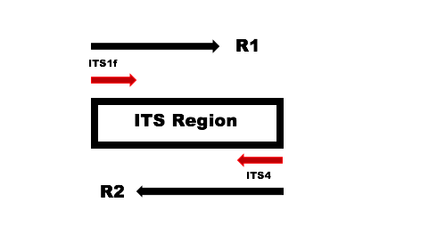
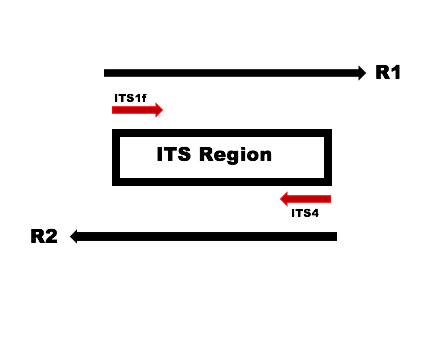

```{r setup, include=FALSE}
knitr::opts_chunk$set(echo = TRUE)
```

This tutorial walks through version 1.8 of the DADA2 pipeline on a small multi-sample ITS amplicon dataset. The starting point is a set of Illumina-sequenced paired-end fastq files that have been split ("demultiplexed") by sample and from which the barcodes have already been removed. The end product is an amplicon sequence variant (ASV) table, a higher-resolution analogue of the traditional OTU table, providing records of the number of times each exact [amplicon sequence variant](https://www.nature.com/articles/ismej2017119) was observed in each sample. We also assign taxanomy to the output sequences. 

##Introduction

The Internal Transcribed Spacer (ITS) workflow is similar to the 16S workflow, with certain modifications implemented in the pipeline specific to the ITS region. One of the key additions in this workflow is the identification and removal of primers on the forward and reverse reads. The presence of primers on the forward and reverse reads can lead to false positive ASVs in the final sequence table. Additionally, due to the length variation in the ITS region, the raw sequences can sometimes be read into the other primer leading to the presence of the second primer at the end of the read. Hence, checking for primers in the forward, complement, reverse and reverse complement orientation is necessary in the ITS workflow. 

Due to the complex nature of the ITS region, we suggest using an external program such as [cutadapt](http://cutadapt.readthedocs.io/en/stable/index.html) for removal of primers from the ITS amplicon sequencing data.

A key characteristic of the ITS region is being highly variable in length ranging from 200 - 600 bp in length depending on which region is targeted, i.e., ITS1 or ITS2. Due to this high variability in length, the ITS workflow does not suggest trimming the reads to a specific length as this could lead to loss of actual sequence variants. 


 


Schematic 1 here depicts a scenario where the forward and reverse reads overlap and allows for capturing the entire ITS region and schematic 2 here depicts a scenario where the forward and reverse read into the second primer and the reverse complement is present at the end of the read.

## Starting point

This workflow assumes that your sequencing data meets certain criteria: 

+ Samples have been demultiplexed, i.e., split into individual per-sample fastq files. 
+ If paired-end sequencing data, the forward and reverse fastq files contain reads in matched order. 

You can also refer to the [FAQ](https://benjjneb.github.io/dada2/faq.html) for recommendations for some common issues.

##Getting ready

Along with the `dada2` library, we also load the `ShortRead` and the `Biostrings` package (R Bioconductor packages; can be installed from the following locations, [dada2](https://benjjneb.github.io/dada2/dada-installation.html), [ShortRead](https://bioconductor.org/packages/release/bioc/html/ShortRead.html) and [Biostrings](https://bioconductor.org/packages/release/bioc/html/Biostrings.html)) which will be help in identification and count of the primers present on the raw FASTQ sequence files.  

```{r dada2 Library, warning=FALSE, message=FALSE, tidy=TRUE, results='hold'}
library(dada2);
packageVersion("dada2")
library(ShortRead);
packageVersion("ShortRead")
library(Biostrings);
packageVersion("Biostrings")
```

If the packages loaded successfully, we are ready to follow the ITS workflow steps. 

##Functions for Primer Identification

To ensure primer removal from the raw FASTQ files, we first identify the presence of the primers in the forward, complement, reverse and reverse complement forms. Once we identify the primers presence, we can trim these primers before processing with DADA2 for the ITS workflow. 

The below functions labeled, prmr_funcn takes the primer sequence as an input and returns the primer in its forward, complement, reverse and reverse complement forms. The vcnt_funcn takes the primer forms as created in the prmr_funcn step as input along with the untrimmed primer FASTQ file and identifies the presence and the number of times of their occurence.


```{r Primer function, warning=FALSE, message=FALSE, tidy=TRUE}
prmr_funcn <- function(prmr){
prmr_dna <- DNAString(prmr)
cmplmnt <- toString(complement(prmr_dna))
rvrse <- toString(reverse(prmr_dna))
rvrse_cmplmnt <- toString(reverseComplement(prmr_dna))
return(c(prmr,cmplmnt,rvrse,rvrse_cmplmnt))}


vcnt_funcn <- function(prmr,filt_seq)
  {vcount_pattern <- vcountPattern(prmr,DNAStringSet(filt_seq),fixed = FALSE)
  return(sum(vcount_pattern))}
```


##Trimming primers on the untrimmed FASTQ reads

The dataset used here is a Mock ITS community constructed by selecting a 23 known fungal cultures from the Center for Forest Mycology Research (CFMR) culture collection and sequenced on an Illumina MiSeq using a 2 X 300 bp sequencing kit. The primers used for this construction are as listed below, we create the complement, reverse and reverse complement forms of the primer ITS1f and ITS4 using the forward orientation of the primer as the input to the prmr_funcn. 


```{r ITS primers, warning=FALSE, message=FALSE, tidy=TRUE, comment="NA"}
ITS1f <- "GTGARTCATCGAATCTTTG" ## Define your primer sequence here
ITS4 <- "TCCTCCGCTTATTGATATGC"
ITS1f.form <- prmr_funcn(ITS1f)
ITS4.form <- prmr_funcn(ITS4)
primer.form <- c(ITS1f.form, ITS4.form)
ITS4.form ##The output is ordered in the forward, complement, reverse and reverse complement orientations of the ITS4 primer.
```

The presence of ambiguous bases in the construction of primers makes accurate counting of the primers with the presence of Ns in raw FASTQ files difficult. We first remove the Ns using the filterAndTrim function in DADA2. 

To follow along, download the example data and unzip. These are paired-end fastq files which are to be processed. Define the following path variable so that it points to the extracted directory on **your** machine:

```{r N removal, warning=FALSE, message=FALSE, tidy=TRUE}
path <- "~/Desktop/ITS_mock_community" ## CHANGE ME to the directory containing the fastq files.
list.files(path)
```

If the `list.files` listed all the files you expect, identify the FASTQ files pattern for **your** sequence files. Here, the sequence files have the "R1_001.fastq.gz" and "R2_001.fastq.gz" format, we use these file patterns to read in the sequence files and perform some string manipulation to get matched lists of the forward and reverse fastq files. 

For the filterAndTrim step, we need to create an output location for the N trimmed sequence files. We use the names of the initial sequences and create a new file location followed by running the filterAndTrim step.

``` {r Mock file names, warning=FALSE, message = FALSE, tidy=TRUE}
Mock.fnFs <- sort(list.files(path, pattern = "R1_001.fastq.gz", full.names = TRUE))
Mock.fnRs <- sort(list.files(path, pattern = "R2_001.fastq.gz", full.names = TRUE))
mock.names <- sapply(strsplit(basename(Mock.fnFs),"_"),'[',1)
mock.names ## Lists the names of all the sequence files
Mock.fnFs.filtN <- file.path(path, "filtN", paste0(mock.names, "_R1_filtN.fastq.gz"))
Mock.fnRs.filtN <- file.path(path, "filtN", paste0(mock.names, "_R2_filtN.fastq.gz"))
filterAndTrim(Mock.fnFs, Mock.fnFs.filtN, Mock.fnRs, Mock.fnRs.filtN, maxN = 0, multithread = TRUE)
```


After the removal of Ns from the raw reads, we can now count the primers present in the sequence files using the vcnt_funcn. Identifying and counting the primers on one set of paired end FASTQ files is sufficient as it helps identify the primers on the remaining sequence files assuming all the files were created using the same library preparation.

Here we read in the Ns removed FASTQ file using the `readFastq` function from the ShortRead package and then store it as a character vector. 

```{r Sequence read in, warning=FALSE, message=FALSE, tidy=TRUE}
Mock.R1.filtN <- as.character(sread(readFastq(Mock.fnFs[1])))
Mock.R2.filtN <- as.character(sread(readFastq(Mock.fnRs[1])))
```

The outputs from applying the `vnct_funcn` show the presence of the primers on the FASTQ files. 

```{r Primer check, warning=FALSE, message=FALSE, tidy=TRUE, results='hold'}
# Checking and counting the presence of the primer set in the forward read
sapply(primer.form, vcnt_funcn, filt_seq = Mock.R1.filtN)
# Checking and counting the presence of the primer set in the reverse read
sapply(primer.form, vcnt_funcn, filt_seq = Mock.R2.filtN)

```

The forward orientation of the ITS1f and the reverse complement orientation of the ITS4 primer are present on the forward FASTQ file, the forward orientation of the ITS4 and the reverse complement orientation of the ITS1f primer are present on the reverse FASTQ file.

These primers can be now removed using a primer/adapter removal tool. Here, we use cutadapt for this process which can be obtained at:  [cutadapt](http://cutadapt.readthedocs.io/en/stable/index.html).


We create an output file name and location for the cutadapt output files using the names of the sequence files. 

First we define the paths, parameters and arguments to be assigned to cutadapt for trimming the primers on the sequence files. The trim.command with the argument, -n indicates that 2 primers are being removed on the sequence file and -m 50 to discard any reads whose below the length of 50 bp. The primers here are removed using the arguments, -g for the forward orientation of ITS1f on the forward read, -a for the reverse complement orientation of the ITS4 primer, -G for the forward orientation of ITS14 from the reverse read and -A  the reverse complement orientation of the ITS4 primer. The cutadapt.path points to the cutadapt installed location. 

The `system2` function is used to run cutadapt within R.

```{r system command, warning=FALSE, message=FALSE, tidy=TRUE}
dir.create(file.path(path,"cutadapt_trimmed"))
path.cutadapt <- "~/Desktop/ITS_mock_community/cutadapt_trimmed"
Mock.fnFs.cutadapt <- file.path(path.cutadapt, paste0(mock.names,"_R1_trimmed.fastq.gz"))
Mock.fnRs.cutadapt <- file.path(path.cutadapt, paste0(mock.names,"_R2_trimmed.fastq.gz"))
trim.cmd <- "-n 2 -m 50"
primers<-c("-g GTGARTCATCGAATCTTTG", "-a GCATATCAATAAGCGGAGGA","-G TCCTCCGCTTATTGATATGC", "-A CAAAGATTCGATGAYTCAC")
cutadapt.path<-"/Users/nbetrap/miniconda2/bin/cutadapt" ##Change to the cutadapt installed path

for(i in 1:length(mock.names)) {
  system2(cutadapt.path, args = c(primers, trim.cmd, "-o", Mock.fnFs.cutadapt[i],"-p", Mock.fnRs.cutadapt[i], Mock.fnFs.filtN[i], Mock.fnRs.filtN[i]))
}
```

As a sanity check, we read in the cutadapt trimmed file to confirm the removal of primers on the sequence files. 

```{r Trimmed read in, warning=FALSE, message=FALSE, tidy=TRUE}
Mock.R1.trimmed <- as.character(sread(readFastq(Mock.fnFs.cutadapt[1])))
Mock.R2.trimmed <- as.character(sread(readFastq(Mock.fnRs.cutadapt[2])))
```

Similar to the step earlier, the `vcnt_funcn` is used to confirm the presence of the primers. 

```{r Primer check trimmed, warning=FALSE, message=FALSE, tidy=TRUE, results='hold'}
# Checking and counting the presence of the primer set in the forward read
sapply(primer.form, vcnt_funcn, filt_seq=Mock.R1.trimmed)
# Checking and counting the presence of the primer set in the reverse read
sapply(primer.form, vcnt_funcn, filt_seq=Mock.R2.trimmed)
```

The output confirms that cutadapt has trimmed all the primers on the sequence files. 

The primer trimmed sequence files are now ready to be analyzed through the DADA2 pipeline.

Similar to the earlier steps of reading in FASTQ files, we read in the names of the FASTQ files and applying some string manipulation to get the matched lists of forward and reverse fastq files.

```{r Import files, warning=FALSE, message=FALSE, tidy=TRUE}
#Forward and reverse fastq filenames have the format: 
fnFs <- sort(list.files(path.cutadapt, pattern = "R1_trimmed.fastq", full.names = TRUE))
fnRs <- sort(list.files(path.cutadapt, pattern = "R2_trimmed.fastq", full.names = TRUE))

# Extract sample names, assuming filenames have format: 

sample.names <- sapply(strsplit(basename(fnFs),"_"),'[',1)
sample.names
```

##Inspect read quality profiles

We start by visualizing the quality profiles of the forward reads:

```{r Quality Profile forward, warning=FALSE, message=FALSE, tidy=TRUE}
plotQualityProfile(fnFs[1:2])
```

The quality profile plot is a gray-scale heatmap of the frequency of each quality score at each base position. The median quality score at each position is shown by the green line, and the quartiles of the quality score distribution by the orange lines. The read line shows the scaled proportion of reads that extend to at least that position (this is useful for other sequencing technologies, as Illumina reads are typically all the same length, hence the flat red line). 

The forward reads are of good quality. In general, trimming the last few nucleotides to avoid less well-controlled errors that can arise has been suggested, e.g: DADA2 Pipeline Tutorial for 16S, however due to the length variation observed in ITS amplicon sequences, trimming is not been suggested. 

Now we visualize the quality profile of the reverse reads:

```{r Quality Profile reverse, warning=FALSE, message=FALSE, tidy=TRUE}
plotQualityProfile(fnRs[1:2])
```

The reverse reads are comparitively poorer quality, especially at the end, which is common in Illumina sequencing. In this example, the end reads are not trimmed as DADA2 incorporates quality information into its error model which makes the algorithm [robust to lower quality sequence](https://twitter.com/bejcal/status/771010634074820608). 

##Filter and trim

Assigning the filenames for the output of the filtered reads to be stored as fastq.gz files. 

```{r filt_output, warning=FALSE, message=FALSE, tidy=TRUE}
filtFs <- file.path(path.cutadapt, "filtered", paste0(sample.names, "_F_filt.fastq.gz"))
filtRs <- file.path(path.cutadapt, "filtered", paste0(sample.names, "_R_filt.fastq.gz"))
```

Based on the user input and using default parameters, DADA2's function, filterAndTrim is one of the key steps to obtain high-resolution ITS amplicon sequences. For this dataset, we will use standard filtering paraments: `maxN=0` (DADA2 requires sequences contain no Ns), `truncQ = 2`, `rm.phix = TRUE` and `maxEE=2`. The `maxEE` parameter sets the maximum number of "expected errors" allowed in a read, which is a [better filter than simply averaging quality scores](http://www.drive5.com/usearch/manual/expected_errors.html).

```{r Filter and Trim, warning=FALSE, message=FALSE, tidy=TRUE}
out<-filterAndTrim(fnFs, filtFs,fnRs, filtRs,maxN = 0, maxEE = c(2,2), truncQ =2, rm.phix = TRUE, compress = TRUE, multithread = TRUE) # on windows, set multithread = FALSE
(out)
```

##Learn the Error Rates

The DADA2 algorithm makes use of a parametric error model (`err`) and every amplicon dataset has a different set of error rates. The `learnErrors` method learns this error model from the data, by alternating estimation of the error rates and inference of sample composition until they converge on a jointly consistent solution. As in many machine-learning problems, the algorithm must begin with an initial guess, for which the maximum error rate in this data are used (the error rates if only the most abundant sequence is correct and all the rest are errors). The below steps are learning errors from the forward and reverse reads. 

```{r Error rate, warning=FALSE, message=FALSE, tidy=TRUE}
errF <- learnErrors(filtFs,multithread = TRUE)
```

```{r Error rate reverse, warning=FALSE, message=FALSE, tidy=TRUE}
errR <- learnErrors(filtRs,multithread = TRUE)
```

As a sanity check, it is worth visualizing the estimated error rates:

```{r Plot Quality Profile, warning=FALSE, message=FALSE, tidy=TRUE}
plotErrors(errF, nominalQ=TRUE)
```

The error rates for each possible transition (A→C, A→G, …) are shown. Points are the observed error rates for each consensus quality score. The black line shows the estimated error rates after convergence of the machine-learning algorithm. The red line shows the error rates expected under the nominal definition of the Q-score. Here the estimated error rates (black line) are a good fit to the observed rates (points), and the error rates drop with increased quality as expected. Everything looks reasonable and we proceed with confidence.

##Dereplication

Dereplication combines all identical sequencing reads into their “unique sequences” with a corresponding “abundance” equal to the number of reads with that unique sequence. Dereplication substantially reduces computation time by eliminating redundant comparisons.

Dereplication in the DADA2 pipeline has one crucial addition from other pipelines: DADA2 *retains a summary of the quality information associated with each unique sequence*. The consensus quality profile of a unique sequence is the average of the positional qualities from the dereplicated reads. These quality profiles inform the error model of the subsequent sample inference step, significantly increasing DADA2’s accuracy.


```{r Dereplication, warning=FALSE, message=FALSE, tidy=TRUE}
derepFs <- derepFastq(filtFs, verbose=TRUE)
derepRs <- derepFastq(filtRs, verbose=TRUE)
# Name the derep-class objects by the sample names
names(derepFs) <- sample.names
names(derepRs) <- sample.names
```

##Sample Inference

At this step, [the core sample inference algorithm](https://www.nature.com/articles/nmeth.3869#methods) is applied to the dereplicated data. 

```{r dada2, warning=FALSE, message=FALSE, tidy=TRUE}
dadaFs <- dada(derepFs, err=errF, multithread=TRUE)
dadaRs <- dada(derepRs, err=errR, multithread=TRUE)
```

Inspecting the returned `data-class` object:

```{r dada2 object, warning=FALSE, message=FALSE, tidy=TRUE}
dadaFs[1]
```

The DADA2 algorithm inferred 76 true sequence variants from the 61773 unique sequences in the first sample. There is much more to the `dada-class` return object than this (see help(`"dada-class"`) for some info), including multiple diagnostics about the quality of each denoised sequence variant, but that is beyond the scope of an introductory tutorial.

##Merge paired reads

After applying the core sample inference algorithm, the forward aand reverse reads are merged to obtain the full denoise sequences. Merging is performed by aligning the denoised forward reads with the reverse-complement of the corresponding denoised reverse reads, and then constructing the merged "contig" sequences. By default, merged sequences are only output if the forward and reverse reads overlap by at least 12 bases, and are identical to each other in the overlap region. 


```{r Mergers, warning=FALSE, message=FALSE}
mergers <- mergePairs(dadaFs, derepFs, dadaRs, derepRs, verbose=TRUE)
# Inspect the merger data.frame from the first sample
head(mergers[[1]])
```

The `mergers` object is a list of `data.frames` from each sample. Each `data.frame` contains the merged `$sequence`, its `$abundance`, and the indices of the `$forward` and `$reverse` sequence variants that were merged. Paired reads that did not exactly overlap were removed by `mergePairs`, further reducing spurious output.

##Construct Sequence Table

We can now construct an amplicon sequence variant table (ASV) table, a higher-resolution version of the OTU table produced by traditional methods.

```{r Seqtab, warning=FALSE, message=FALSE, tidy=TRUE}
seqtab <- makeSequenceTable(mergers)
```


```{r seqtab dimension, warning=FALSE,message=FALSE, tidy=TRUE}
dim(seqtab)
```


```{r Distribution of lengths, warning=FALSE,message=FALSE, tidy=TRUE}
# Inspect distribution of sequence lengths
table(nchar(getSequences(seqtab)))
```


The sequence table is a `matrix` with rows corresponding to (and named by) the samples, and columns corresponding to (and named by) the sequence variants. This table contains 41 ASVs. 

##Remove Chimeras

The core `dada` method corrects substitution and indel errors, but chimeras remain. Fortunately, the accuracy of the sequence variants after denoising makes identifying chimeras simpler than it is when dealing with fuzzy OTUs. Chimeric sequences are identified if they can be exactly reconstructed by combining a left-segment and a right-segment from two more abundant “parent” sequences.

```{r seqtab chimera removal, warning=FALSE, message=FALSE}
seqtab.nochim <- removeBimeraDenovo(seqtab, method="consensus", multithread=TRUE, verbose=TRUE)
dim(seqtab.nochim)
```

```{r seqtab sum, warning=FALSE, message=FALSE, tidy=TRUE}
sum(seqtab.nochim)/sum(seqtab)
```

The frequency of chimeric sequences varies substantially from dataset to dataset, and depends on on factors including experimental procedures and sample complexity. Here chimeras make up about 32% of the merged sequence variants, but when we account for the abundances of those variants we see they account for less than 1% of the merged sequence reads.


##Track reads through the pipeline

As a final check of our progress, we will look at the number of reads that made it through each step in the pipeline: 

```{r Track reads, warning=FALSE, message=FALSE, tidy=TRUE}
getN <- function(x) sum(getUniques(x))
track <- cbind(out, sapply(dadaFs, getN), sapply(dadaRs, getN), sapply(mergers, getN), rowSums(seqtab.nochim))
# If processing a single sample, remove the sapply calls: e.g. replace sapply(dadaFs, getN) with getN(dadaFs)
colnames(track) <- c("input", "filtered", "denoisedF", "denoisedR", "merged", "nonchim")
rownames(track) <- sample.names
head(track)
```

##Assign taxonomy

It is common at this point, especially in 16S/18S/ITS amplicon sequencing, to assign taxonomy to the sequence variants. The DADA2 package provides a native implementation of the [naive Bayesian classifier method](https://www.ncbi.nlm.nih.gov/pubmed/17586664) for this purpose. The `assignTaxonomy` function takes as input a set of sequences to ba classified, and a training set of reference sequences with known taxonomy, and outputs taxonomic assignments with at least minBoot bootstrap confidence.

We maintain [formatted training fastas for the RDP training set, GreenGenes clustered at 97% identity, and the Silva reference database](https://benjjneb.github.io/dada2/training.html), and additional trainings fastas suitable for protists and certain specific environments have been contributed. For fungal taxonomy, the General Fasta release files from the [UNITE ITS database](https://unite.ut.ee/repository.php) can be used as is. 

```{r Taxa assignment, message=FALSE, warning=FALSE, tidy=TRUE}
taxa <- assignTaxonomy(seqtab.nochim, "~/Desktop/Taxonomy_assignment_databases/sh_general_release_dynamic_s_01.12.2017.fasta", multithread=TRUE,tryRC = TRUE)
```


Inspecting the taxonomic assignments:

```{r Taxonomy inspection, warning=FALSE, message=FALSE, tidy=TRUE}
taxa.print <- taxa # Removing sequence rownames for display only
rownames(taxa.print) <- NULL
head(taxa.print)
```

