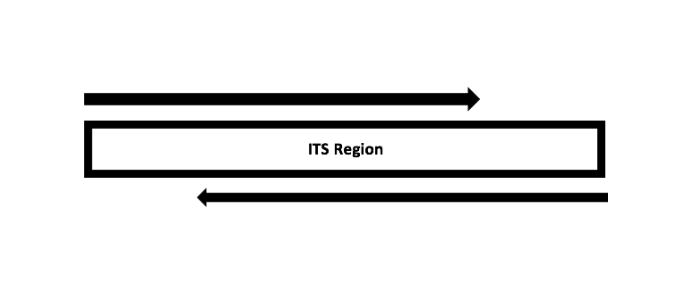
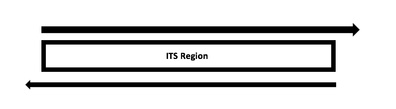

```{r setup, include=FALSE}
knitr::opts_chunk$set(echo = TRUE, fig.align="center")
```

##Introduction

This tutorial walks through version 1.8 of the DADA2 pipeline on a small multi-sample ITS amplicon dataset. The starting point is a set of Illumina-sequenced paired-end fastq files that have been split ("demultiplexed") by sample. The end product is an amplicon sequence variant (ASV) table, a higher-resolution analogue of the traditional OTU table, providing records of the number of times each exact amplicon sequence variant was observed in each sample. We also assign taxanomy to the output sequences. 

The Internal Transcribed Spacer (ITS) workflow is similar to the 16S workflow, with certain modifications implemented in the pipeline specific to the ITS region. One of the key additions in this workflow is the identification and removal of primers on the forward and reverse reads. The presence of primers on the forward and reverse reads is problematic as it can lead to false positive ASVs in the obtained sequence table. Additionally, due to the length variation in the ITS region, the raw sequences can sometimes be read into the other primer leading to the presence of the second primer at the end of the read. Hence, checking for primers in the forward, reverse and reverse complement orientation is necessary in the ITS workflow. 

Also, the ITS region is highly variable in length ranging from 200 - 600 bp in length depending on which region is targeted, i.e., ITS1 or ITS2. Due to this high variability in length, the ITS workflow does not suggest trimming the reads to a specific length as this could lead to loss of actual sequence variants. 

The schematic depicts the length variation seen in the ITS region. The read, R1 with the primer ITS1f reads into the second primer, ITS4 and thus checking the presence of the primer on both ends is necessary. The read R2, with the primer ITS4 reads from the ITS2 region into the ITS1 region and this is possible due to the length variation often observed in the ITS region.






Due to the complex nature of the ITS region, we suggest using an external program such as [Cutadapt](http://cutadapt.readthedocs.io/en/stable/index.html) for removal of primers from the ITS amplicon sequencing data.


## Starting point

This workflow assumes that your sequencing data meets certain criteria: 

+ Samples have been demultiplexed, i.e., split into individual per-sample fastq files. 
+ If paired-end sequencing data, the forward and reverse fastq files contain reads in matched order. 


##Getting ready

Along with the DADA2 library, we also load the ShortRead and the Biostrings package (Bioconductor packages; can be installed from the following locations, [ShortRead](https://bioconductor.org/packages/release/bioc/html/ShortRead.html) and [Biostrings](https://bioconductor.org/packages/release/bioc/html/Biostrings.html)) which will be used in identification of the primers and the count the number of primers present on the raw FASTQ sequence files.  

```{r dada2 Library, warning=FALSE, message=FALSE, tidy=TRUE}
library(dada2);
packageVersion("dada2")
library(ShortRead);
packageVersion("ShortRead")
library(Biostrings);
packageVersion("Biostrings")
```


##Creating functions for Primer Identification

At this step, we identify the presence of the primers in the forward, reverse and reverse complement forms on the raw Illumina reads. Once we identify the primers presence, we can trim these primers before processing with DADA2 for the ITS workflow. The below functions labeled, prmr_funcn takes the primer sequence as an input and returns the primer in its forward, reverse and reverse complement forms. The vcnt_funcn takes the primer forms as created in the prmr_funcn step and identifies the presence of the primer in the raw sequence file along with providing counts of their occurence in total in the FASTQ sequence file.


```{r Primer function, warning=FALSE, message=FALSE, tidy=TRUE}
prmr_funcn <- function(prmr){
prmr_dna <- DNAString(prmr)
prmr_dna_comp <- complement(prmr_dna)
prmr_dna_rev <- reverse(prmr_dna)
prmr_dna_revcomp <- reverseComplement(prmr_dna)
prmr_dna_comp <- toString(prmr_dna_comp)
prmr_dna_rev <- toString(prmr_dna_rev)
prmr_dna_revcomp <- toString(prmr_dna_revcomp)
return(c(prmr,prmr_dna_comp,prmr_dna_rev,prmr_dna_revcomp))}


vcnt_funcn <- function(prmr,filt_seq)
  {vcount_pattern<-vcountPattern(prmr,DNAStringSet(filt_seq),fixed = FALSE)
  return(sum(vcount_pattern))}
```


##Trimming primers on the Raw reads

The dataset used here is a Mock community constructed by selecting a 23 known fungal cultures from the Center for Forest Mycology Research (CFMR) culture collection and they were sequenced on an Illumina MiSeq using a 2 X 300 bp sequencing kit. The primers used for this construction are as listed below:

```{r ITS primers, warning=FALSE, message=FALSE, tidy=TRUE}
ITS1f <- "GTGARTCATCGAATCTTTG"
ITS4 <- "TCCTCCGCTTATTGATATGC"
```


At this step, we create the reverse and reverse complement forms of the primer ITS1f and ITS4. 


```{r Primer form, warning=FALSE, message=FALSE, tidy=TRUE}
ITS1f_form <- prmr_funcn(ITS1f)
ITS1f_form
ITS4_form <- prmr_funcn(ITS4)
```

Due to the ambiguous nature in the construction of primers, the vcnt_funcn can count Ns in the reads as primers and provide false numbers of primer presence. We use the DADA2 function, filterAndTrim to remove the Ns in the reads.


```{r N removal, warning=FALSE, message=FALSE, tidy=TRUE}
path <- "~/Desktop/ITS_mock_community"
list.files(path)
Mock.fnFs <- sort(list.files(path, pattern = "R1_001.fastq.gz", full.names = TRUE))
Mock.fnRs <- sort(list.files(path, pattern = "R2_001.fastq.gz", full.names = TRUE))
mock.names <- sapply(strsplit(basename(Mock.fnFs),"_"),'[',1)
mock.names
Mock.fnFs.filtN <- file.path(path, "filtN", paste0(mock.names, "_R1_filtN.fastq.gz"))
Mock.fnRs.filtN <- file.path(path, "filtN", paste0(mock.names, "_R2_filtN.fastq.gz"))

filterAndTrim(Mock.fnFs, Mock.fnFs.filtN, Mock.fnRs, Mock.fnRs.filtN, maxN = 0, multithread = TRUE)
```

After removal of Ns from the raw reads, we now read in the file and store them as a character vector making the read compatible for the vcnt_funcn.

```{r Sequence read in, warning=FALSE, message=FALSE, tidy=TRUE}
Mock.R1.filtN <- readFastq("~/Desktop/ITS_mock_community/filtN/m4C-mock3-16000_R1_filtN.fastq.gz")
Mock.R1.filtN.seq <- as.character(sread(Mock.R1.filtN))
Mock.R2.filtN <- readFastq("~/Desktop/ITS_mock_community/filtN/m4C-mock3-16000_R2_filtN.fastq.gz")
Mock.R2.filtN.seq <- as.character(sread(Mock.R2.filtN))
```


We identify the presence of primers and their count.

```{r Primer check, warning=FALSE, message=FALSE, tidy=TRUE}
sapply(ITS1f_form,vcnt_funcn,filt_seq=Mock.R1.filtN.seq)
sapply(ITS4_form,vcnt_funcn,filt_seq=Mock.R1.filtN.seq)
sapply(ITS1f_form,vcnt_funcn,filt_seq=Mock.R2.filtN.seq)
sapply(ITS4_form,vcnt_funcn,filt_seq=Mock.R2.filtN.seq)
```


From the vnct_funcn, we identified the presence of the ITS1f and ITS4 primers on the forward and reverse reads. These primers can be now removed using a primer/adapter removal tool. Here, we use Cutadapt for this process which can be obtained at:  [Cutadapt](http://cutadapt.readthedocs.io/en/stable/index.html).

The below command runs cutadapt from using the system function in R. The input parameters to the system function are, the installed location of the cutadapt program, -g indicates the , -a indicates, -G indicates trimming of primer from the reverse read and -A indicates trimming of primer from the reverse read. The argument, -n indicates the number of primers to be located and removed from the read, the -m 50 argument removes any reads whose length is below 50 bp. 

```{r system command, warning=FALSE, message=FALSE, tidy=TRUE}
path.mock <- "~/Desktop/ITS_mock_community"
Mock.fnFs.cutadapt <- file.path(path,paste0(mock.names,"_R1_trimmed.fastq.gz"))

Mock.fnRs.cutadapt <- file.path(path,paste0(mock.names,"_R2_trimmed.fastq.gz"))
trim.cmd <- "-n 2 -m 50"
cutadapt.path<-"/Users/nbetrap/miniconda2/bin/cutadapt"
primers<-c("-g GTGARTCATCGAATCTTTG", "-a GCATATCAATAAGCGGAGGA","-G TCCTCCGCTTATTGATATGC", "-A CAAAGATTCGATGAYTCAC")

system2(cutadapt.path, args=c(primers, trim.cmd, "-o", Mock.fnFs.cutadapt[1], "-p", Mock.fnRs.cutadapt[1], Mock.fnFs.filtN[1], Mock.fnRs.filtN[1]))


system2(cutadapt.path, args=c(primers, trim.cmd, "-o", Mock.fnFs.cutadapt[2], "-p", Mock.fnRs.cutadapt[2], Mock.fnFs.filtN[2], Mock.fnRs.filtN[2]))
```


After running cutadapt, we read in the trimmed file to confirm the removal of primers on the sequences. 

```{r Trimmed read in, warning=FALSE, message=FALSE, tidy=TRUE}
Mock.R1.trimmed <- readFastq("~/Desktop/ITS_mock_community/m4C-mock3-16000_R1_trimmed.fastq.gz")
Mock.R1.trimmed.seq <- as.character(sread(Mock.R1.trimmed))
Mock.R2.trimmed <- readFastq("~/Desktop/ITS_mock_community/m4C-mock3-16000_R2_trimmed.fastq.gz")
Mock.R2.trimmed.seq <- as.character(sread(Mock.R2.trimmed))
```


```{r Primer check trimmed, warning=FALSE, message=FALSE, tidy=TRUE}
sapply(ITS1f_form,vcnt_funcn,filt_seq=Mock.R1.trimmed.seq)
sapply(ITS4_form,vcnt_funcn,filt_seq=Mock.R1.trimmed.seq)
sapply(ITS1f_form,vcnt_funcn,filt_seq=Mock.R2.trimmed.seq)
sapply(ITS4_form,vcnt_funcn,filt_seq=Mock.R2.trimmed.seq)
```

The output confirms that cutadapt has removed all the primers on the sequences and no primers are present on the sequence files. 

The primer trimmed sequence files are now ready to be analyzed through the DADA2 pipeline.

```{r Path setting, warning=FALSE, message=FALSE, tidy=TRUE}
path <- "~/Desktop/ITS_mock_community"
list.files(path)
```


If the package is successfully loaded and your listed files match those as in the downloaded dataset, you are ready to analyze the data for ITS amplicon sequences through the DADA2 pipeline. 

The first step in the pipeline, is reading in the names of the fastq files and applying some string manipulation to get the matched lists of forward and reverse fastq files.

```{r Import files, warning=FALSE, message=FALSE, tidy=TRUE}
#Forward and reverse fastq filenames have the format: 
fnFs <- sort(list.files(path, pattern = "R1_trimmed.fastq", full.names = TRUE))
fnRs <- sort(list.files(path, pattern = "R2_trimmed.fastq", full.names = TRUE))

# Extract sample names, assuming filenames have format: 

sample.names <- sapply(strsplit(basename(fnFs),"_"),'[',1)
sample.names
```

##Inspect read quality profiles

We start by visualizing the quality profiles of the forward reads:

```{r Quality Profile forward, warning=FALSE, message=FALSE, tidy=TRUE}
plotQualityProfile(fnFs[1:2])
```

The quality profile plot is a gray-scale heatmap of the frequency of each quality score at each base position. The median quality score at each position is shown by the green line, and the quartiles of the quality score distribution by the orange lines. The read line shows the scaled proportion of reads that extend to at least that position (this is useful for other sequencing technologies, as Illumina reads are typically all the same length, hence the flat red line). 

The forward reads are good quality. In general, trimming the last few nucleotides to avoid less well-controlled errors that can arise has been suggested, e.g: DADA2 Pipeline Tutorial for 16S, however due to the length variation observed in ITS amplicon sequences, trimming has not been suggested. 

Now we visualize the quality profile of the reverse reads:

```{r Quality Profile reverse, warning=FALSE, message=FALSE, tidy=TRUE}
plotQualityProfile(fnRs[1:2])
```

The reverse reads are comparitively poorer quality, especially at the end, which is common in Illumina sequencing. In this example, the end reads are not trimmed as DADA2 incorporates quality information into its error model which makes the algorithm robust to lower quality sequence. 

##Filter and trim

Assigning the filenames for the output of the filtered reads to be stored as fastq.gz files. 

```{r filt_output, warning=FALSE, message=FALSE, tidy=TRUE}
filtFs <- file.path(path, "filtered", paste0(sample.names, "_F_filt.fastq.gz"))
filtRs <- file.path(path, "filtered", paste0(sample.names, "_R_filt.fastq.gz"))
```

Based on the user input and using default parameters, DADA2's function, filterAndTrim is one of the key steps to obtain high-resolution amplicon sequences. For this dataset, we will use standard filtering paraments: maxN=0 (DADA2 requires sequences contain no Ns), truncQ = 2, rm.phix = TRUE and maxEE=2. The maxEE parameter sets the maximum number of "expected errors" allowed in a read, which is a better filter than simply averaging quality scores.

```{r Filter and Trim, warning=FALSE, message=FALSE, tidy=TRUE}
out<-filterAndTrim(fnFs, filtFs,fnRs, filtRs,maxN = 0, maxEE = c(2,2), truncQ =2, rm.phix = TRUE, compress = TRUE, multithread = TRUE) # on windows, set multithread = FALSE

(out)
```

##Learn the Error Rates

The DADA2 algorithm makes use of a parametric error model (err) and every amplicon dataset has a different set of error rates. The learnErrors method learns this error model from the data, by alternating estimation of the error rates and inference of sample composition until they converge on a jointly consistent solution. As in many machine-learning problems, the algorithm must begin with an initial guess, for which the maximum error rate in this data are used (the error rates if only the most abundant sequence is correct and all the rest are errors). The below steps are learning errors from the forward and reverse reads. 

```{r Error rate, warning=FALSE, message=FALSE, tidy=TRUE}
errF <- learnErrors(filtFs,multithread = TRUE)
```

```{r Error rate reverse, warning=FALSE, message=FALSE, tidy=TRUE}
errR <- learnErrors(filtRs,multithread = TRUE)
```

As a sanity check, it is worth visualizing the estimated error rates:

```{r Plot Quality Profile, warning=FALSE, message=FALSE, tidy=TRUE}
plotErrors(errF, nominalQ=TRUE)
```

The error rates for each possible transition (A→C, A→G, …) are shown. Points are the observed error rates for each consensus quality score. The black line shows the estimated error rates after convergence of the machine-learning algorithm. The red line shows the error rates expected under the nominal definition of the Q-score. Here the estimated error rates (black line) are a good fit to the observed rates (points), and the error rates drop with increased quality as expected. Everything looks reasonable and we proceed with confidence.

##Dereplication

Dereplication combines all identical sequencing reads into their “unique sequences” with a corresponding “abundance” equal to the number of reads with that unique sequence. Dereplication substantially reduces computation time by eliminating redundant comparisons.

Dereplication in the DADA2 pipeline has one crucial addition from other pipelines: DADA2 retains a summary of the quality information associated with each unique sequence. The consensus quality profile of a unique sequence is the average of the positional qualities from the dereplicated reads. These quality profiles inform the error model of the subsequent sample inference step, significantly increasing DADA2’s accuracy.


```{r Dereplication, warning=FALSE, message=FALSE, tidy=TRUE}
derepFs <- derepFastq(filtFs, verbose=TRUE)
derepRs <- derepFastq(filtRs, verbose=TRUE)
# Name the derep-class objects by the sample names
names(derepFs) <- sample.names
names(derepRs) <- sample.names
```

##Sample Inference

At this step, the core sample inference algorithm is applied to the dereplicated data. 

```{r dada2, warning=FALSE, message=FALSE, tidy=TRUE}
dadaFs <- dada(derepFs, err=errF, multithread=TRUE)
dadaRs <- dada(derepRs, err=errR, multithread=TRUE)
```

Inspecting the returned data-class object:

```{r dada2 object, warning=FALSE, message=FALSE, tidy=TRUE}
dadaFs[1]
```

##Merge paired reads

After applying the core sample inference algorithm, the forward aand reverse reads are merged to obtain the full denoise sequences. Merging is performed by aligning the denoised forward reads with the reverse-complement of the corresponding denoised reverse reads, and then constructing the merged "contig" sequences. By default, merged sequences are only output if the forward and reverse reads overlap by at least 12 bases, and are identical to each other in the overlap region. 


```{r Mergers, warning=FALSE, message=FALSE}
mergers <- mergePairs(dadaFs, derepFs, dadaRs, derepRs, verbose=TRUE)
# Inspect the merger data.frame from the first sample
head(mergers[[1]])
```

The mergers object is a list of data.frames from each sample. Each data.frame contains the merged sequence, its abundance, and the indices of the forward and reverse sequence variants that were merged. Paired reads that did not exactly overlap were removed by mergePairs, further reducing spurious output.

##Construct Sequence Table

We can now construct an amplicon sequence variant table (ASV) table, a higher-resolution version of the OTU table produced by traditional methods.

```{r Seqtab, warning=FALSE, message=FALSE, tidy=TRUE}
seqtab <- makeSequenceTable(mergers)
```


```{r seqtab dimension, warning=FALSE,message=FALSE, tidy=TRUE}
dim(seqtab)
```


```{r Distribution of lengths, warning=FALSE,message=FALSE, tidy=TRUE}
# Inspect distribution of sequence lengths
table(nchar(getSequences(seqtab)))
```


The sequence table is a matrix with rows corresponding to (and named by) the samples, and columns corresponding to (and named by) the sequence variants. This table contains 28 ASVs.

##Remove Chimeras

The core dada method corrects substitution and indel errors, but chimeras remain. Fortunately, the accuracy of the sequence variants after denoising makes identifying chimeras simpler than it is when dealing with fuzzy OTUs. Chimeric sequences are identified if they can be exactly reconstructed by combining a left-segment and a right-segment from two more abundant “parent” sequences.

```{r seqtab chimera removal, warning=FALSE, message=FALSE}
seqtab.nochim <- removeBimeraDenovo(seqtab, method="consensus", multithread=TRUE, verbose=TRUE)
dim(seqtab.nochim)
```

```{r seqtab sum, warning=FALSE, message=FALSE, tidy=TRUE}
sum(seqtab.nochim)/sum(seqtab)
```

The frequency of chimeric sequences varies substantially from dataset to dataset, and depends on on factors including experimental procedures and sample complexity. 


##Track reads through the pipeline

As a final check of our progress, we will look at the number of reads that made it through each step in the pipeline: 

```{r Track reads, warning=FALSE, message=FALSE, tidy=TRUE}
getN <- function(x) sum(getUniques(x))
track <- cbind(out, sapply(dadaFs, getN), sapply(dadaRs, getN), sapply(mergers, getN), rowSums(seqtab.nochim))
# If processing a single sample, remove the sapply calls: e.g. replace sapply(dadaFs, getN) with getN(dadaFs)
colnames(track) <- c("input", "filtered", "denoisedF", "denoisedR", "merged", "nonchim")
rownames(track) <- sample.names
head(track)
```

##Assign taxonomy

It is common at this point, especially in 16S/18S/ITS amplicon sequencing, to assign taxonomy to the sequence variants. The DADA2 package provides a native implementation of the naive Bayesian classifier method for this purpose. The assignTaxonomy function takes as input a set of sequences to ba classified, and a training set of reference sequences with known taxonomy, and outputs taxonomic assignments with at least minBoot bootstrap confidence.

We maintain formatted training fastas for the RDP training set, GreenGenes clustered at 97% identity, and the Silva reference database, and additional trainings fastas suitable for protists and certain specific environments have been contributed. For fungal taxonomy, the General Fasta release files from the UNITE ITS database can be used as is. For this ITS dataset, we use the UNITE ITS database file.

```{r Taxa assignment, message=FALSE, warning=FALSE, tidy=TRUE}
taxa <- assignTaxonomy(seqtab.nochim, "~/Desktop/Taxonomy_assignment_databases/sh_general_release_dynamic_s_01.12.2017.fasta", multithread=TRUE,tryRC = TRUE)
```


Inspecting the taxonomic assignments:

```{r Taxonomy inspection, warning=FALSE, message=FALSE, tidy=TRUE}
taxa.print <- taxa # Removing sequence rownames for display only
rownames(taxa.print) <- NULL
head(taxa.print)
```

